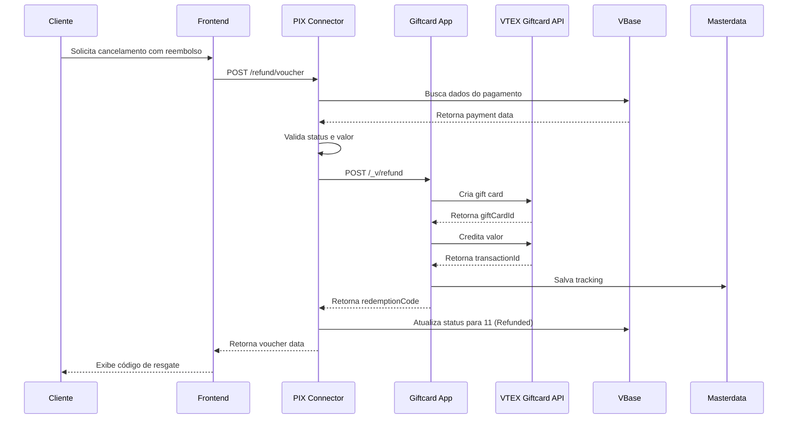

# Arquitetura de Reembolso: PIX com Split e Gift Cards

## Visão Geral

Esta documentação descreve a arquitetura completa para o fluxo de reembolso de pagamentos PIX com Split na plataforma VTEX, integrando três componentes principais:

1. **App Provedor de Pagamento PIX** (`marykay.braspag-pix-connector`)
2. **App de Integração Gift Cards** (`marykay.giftcards-integration`)
3. **App de Split Assíncrono** (futuro)

## Problema: Reembolso PIX Split

### Contexto

No cenário de split de pagamentos PIX com Braspag/Cielo, quando há necessidade de reembolso, surgem limitações técnicas:

- **Estorno via Gateway:** Estornos diretos no gateway Braspag revertem o valor total, mas requerem reconciliação manual do split entre marketplace (master) e consultor (subordinate)
- **Complexidade de Split Reverso:** Reverter automaticamente splits já processados é complexo e pode gerar inconsistências financeiras
- **Risco de Uso:** Cliente que já utilizou parte do benefício do pedido (ex: produtos consumidos) ainda pode requerer reembolso total

### Solução Proposta

Oferecer ao cliente a opção de **reembolso via voucher (gift card)** em cenários de risco médio/alto:

- Cliente que já consumiu produtos/serviços
- Pagamentos com split já processado e liquidado
- Cenários onde estorno direto não é viável

## Arquitetura de Componentes

### 1. App Provedor de Pagamento PIX

**Responsabilidades:**
- Processar autorizações de pagamento PIX
- Gerenciar webhooks da Braspag
- Calcular e enviar split de pagamentos
- **NOVO:** Expor rota de reembolso via voucher

**Endpoints:**
- `POST /_v/pix-connector/refund/voucher` - Processa reembolso via gift card

**Integração:**
- Consome API do app `marykay.giftcards-integration`
- Atualiza status do pagamento para "Refunded" (11)
- Persiste dados no VBase

### 2. App de Integração Gift Cards

**Responsabilidades:**
- Criar gift cards VTEX
- Creditar valores em gift cards
- Gerenciar tracking de reembolsos via Masterdata
- Validar gift cards existentes

**Endpoints:**
- `POST /_v/refund` - Cria ou credita gift card de reembolso
- `GET /_v/giftcard/:giftCardId` - Consulta gift card
- `GET /_v/user-giftcard/:userId` - Lista gift cards do usuário
- `GET /_v/user-refund-giftcards/:userId` - Lista gift cards de reembolso

**Integração:**
- Consome VTEX Giftcard API nativa
- Persiste tracking no Masterdata (entidade `refund_giftcards`)

### 3. App de Split Assíncrono (Futuro)

**Responsabilidades:**
- Receber notificações de pagamento
- Calcular split excluindo valores pagos com gift card
- Executar split no gateway financeiro

**Lógica de Desconto:**

```typescript
const calculateSplitValue = (order) => {
  const totalValue = order.totals.reduce((sum, item) => sum + item.value, 0)
  const giftCardValue = order.payments
    .filter(p => p.paymentSystem === 'GiftCard')
    .reduce((sum, p) => sum + p.value, 0)
  
  return totalValue - giftCardValue
}
```

## Fluxo Completo de Reembolso via Voucher

### Sequência de Eventos



### Estados do Pagamento

| Status | Código | Descrição | Ação Permitida |
|--------|--------|-----------|----------------|
| Pending | 12 | PIX gerado, aguardando pagamento | Cancelar sem estorno |
| Paid | 2 | PIX confirmado e pago | Reembolso via voucher OU estorno direto |
| Refunded | 11 | Valor reembolsado (voucher ou estorno) | Nenhuma |
| Cancelled | 10 | Cancelado antes do pagamento | Nenhuma |

## Decisão de Reembolso: Voucher vs Estorno Direto

### Matriz de Decisão

| Cenário | Método de Pagamento | Status | Risco | Opção Recomendada |
|---------|---------------------|--------|-------|-------------------|
| Pedido não enviado | PIX | Paid (2) | Baixo | Estorno Direto |
| Pedido enviado, não entregue | PIX | Paid (2) | Médio | Voucher OU Estorno |
| Pedido entregue < 7 dias | PIX | Paid (2) | Alto | Voucher |
| Split já liquidado | PIX | Paid (2) | Alto | Voucher |
| Cartão de Crédito | Cartão | Paid (2) | Médio | Estorno Direto |

### Regras de Negócio

**Apresentar apenas Voucher quando:**
- Status = Paid (2) E
- Split já processado/liquidado E
- Prazo de entrega > 7 dias OU produto já consumido

**Apresentar ambas opções (Voucher + Estorno) quando:**
- Status = Paid (2) E
- Split não liquidado E
- Pedido rastreável (não entregue)

**Apresentar apenas Estorno quando:**
- Status = Paid (2) E
- Método de pagamento = Cartão

## Integração com Split Assíncrono

### Exclusão de Gift Card do Split

Quando um pedido contém pagamento parcial ou total via gift card, o app de split assíncrono deve:

1. Receber notificação do pagamento
2. Extrair valor pago com gift card do payload
3. Subtrair esse valor do total antes de calcular split
4. Executar split apenas sobre valor pago com outros métodos

**Exemplo:**

```json
{
  "orderId": "v123456-01",
  "totalValue": 20000,
  "payments": [
    { "paymentSystem": "GiftCard", "value": 5000 },
    { "paymentSystem": "PIX", "value": 15000 }
  ]
}
```

**Cálculo:**
- Total: R$ 200,00
- Gift Card: R$ 50,00
- **Split calculado sobre:** R$ 150,00 (PIX)

### Endpoint para Consulta de Gift Card

O app de split assíncrono pode consumir:

```
GET /_v/user-giftcard/:userId
```

Para verificar se o cliente possui gift cards ativos antes de processar o split.

## Segurança e Auditoria

### Autenticação

- Todas as rotas são públicas mas autenticadas via VTEX IO context
- Tokens VTEX gerenciam permissões internamente
- Logs detalhados via Datadog

### Logging

Eventos auditados:
- `VOUCHER_REFUND_HANDLER: Received request`
- `VOUCHER_REFUND: Starting process`
- `VOUCHER_REFUND: Creating giftcard via app`
- `VOUCHER_REFUND: Giftcard created successfully`
- `VOUCHER_REFUND: Payment status updated to 11`

### Idempotência

- Verificação de status antes de processar
- Retorno de erro se pagamento já reembolsado
- Tracking de reembolsos no Masterdata

## Testes e Validação

### Testes Unitários

```typescript
// Cenário 1: Reembolso bem-sucedido
const result = await voucherRefundService.processVoucherRefund({
  orderId: 'v123-01',
  paymentId: 'PAY123',
  userId: 'USR456',
  refundValue: 10000
})

expect(result.success).toBe(true)
expect(result.giftCardId).toBeDefined()
expect(result.redemptionCode).toBeDefined()
```

### Testes de Integração

1. Criar pagamento PIX
2. Confirmar pagamento (status 2)
3. Chamar endpoint de reembolso via voucher
4. Validar gift card criado
5. Verificar status atualizado para 11

### Testes End-to-End

1. Cliente realiza compra com PIX
2. Pagamento é confirmado
3. Cliente solicita cancelamento via "Meus Pedidos"
4. Sistema apresenta opção de voucher
5. Cliente confirma reembolso via voucher
6. Sistema cria gift card
7. Cliente recebe email com código de resgate
8. Cliente usa voucher em nova compra

## Próximos Passos

- [ ] Implementar frontend de escolha de reembolso em "Meus Pedidos"
- [ ] Criar app de split assíncrono com lógica de desconto de gift card
- [ ] Implementar notificações por email com código de resgate
- [ ] Adicionar dashboard de gestão de vouchers no admin VTEX
- [ ] Criar relatório de reconciliação de reembolsos
- [ ] Implementar expiração automática de vouchers não utilizados

